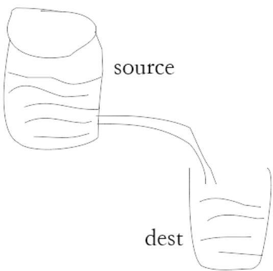

# node笔记
（阅读地址：[node教程](http://fis.baidu.com/fis3/docs/beginning/intro.html)）

# 应用创建
## 引入模块
require 指令来载入 http 模块，并将实例化的 HTTP 赋值给变量 http，实例如下: 
```
var http = require("http");
```

## 创建服务器
使用 http.createServer() 方法创建服务器，并使用 listen 方法绑定 8888 端口。 函数通过 request, response 参数来接收和响应数据。

实例如下，在你项目的根目录下创建一个叫 server.js 的文件，并写入以下代码：

```
var http = require('http');

http.createServer(function (request, response) {

	// 发送 HTTP 头部 
	// HTTP 状态值: 200 : OK
	// 内容类型: text/plain
	response.writeHead(200, {'Content-Type': 'text/plain'});

	// 发送响应数据 "Hello World"
	response.end('Hello World\n');
}).listen(8888);

// 终端打印如下信息
console.log('Server running at http://127.0.0.1:8888/');
```
打开浏览器8888端口将看到返回的数据

# npm使用介绍
NPM是随同NodeJS一起安装的包管理工具，能解决NodeJS代码部署上的很多问题，常见的使用场景有以下几种：

    允许用户从NPM服务器下载别人编写的第三方包到本地使用。
    允许用户从NPM服务器下载并安装别人编写的命令行程序到本地使用。
    允许用户将自己编写的包或命令行程序上传到NPM服务器供别人使用。

## 基础使用说明
由于新版的nodejs已经集成了npm，所以之前npm也一并安装好了。同样可以通过输入 "npm -v" 来测试是否成功安装。命令如下，出现版本提示表示安装成

如果你安装的是旧版本的 npm，可以很容易得通过 npm 命令来升级，命令如下：
```
npm install npm -g
```
 查看全局安装的命令：
```
$ npm ls -g
```
## Package.json 属性说明


    name - 包名。

    version - 包的版本号。

    description - 包的描述。

    homepage - 包的官网 url 。

    author - 包的作者姓名。

    contributors - 包的其他贡献者姓名。

    dependencies - 依赖包列表。如果依赖包没有安装，npm 会自动将依赖包安装在 node_module 目录下。

    repository - 包代码存放的地方的类型，可以是 git 或 svn，git 可在 Github 上。

    main - main 字段是一个模块ID，它是一个指向你程序的主要项目。就是说，如果你包的名字叫 express，然后用户安装它，然后require("express")。

    keywords - 关键字

## 卸载模块

```
$ npm update express
```

## 搜索模块

```
$ npm search express
```

# Node.js 回调函数

Node.js 异步编程的直接体现就是回调。

异步编程依托于回调来实现，但不能说使用了回调后程序就异步化了。

回调函数在完成任务后就会被调用，Node 使用了大量的回调函数，Node 所有 API 都支持回调函数。

例如，我们可以一边读取文件，一边执行其他命令，在文件读取完成后，我们将文件内容作为回调函数的参数返回。这样在执行代码时就没有阻塞或等待文件 I/O 操作。这就大大提高了 Node.js 的性能，可以处理大量的并发请求。

## 阻塞代码实例
创建一个文件 input.txt 
创建 main.js 文件, 代码如下：
```
var fs = require("fs");

var data = fs.readFileSync('input.txt');

console.log(data.toString());
console.log("程序执行结束!");
```

## 非阻塞代码实例
```
var fs = require("fs");

fs.readFile('input.txt', function (err, data) {
    if (err) return console.error(err);
    console.log(data.toString());
});

console.log("程序执行结束!");
```

# 事件循环
Node.js 是单进程单线程应用程序，但是通过事件和回调支持并发，所以性能非常高。

Node.js 的每一个 API 都是异步的，并作为一个独立线程运行，使用异步函数调用，并处理并发。

Node.js 基本上所有的事件机制都是用设计模式中观察者模式实现。

Node.js 单线程类似进入一个while(true)的事件循环，直到没有事件观察者退出，每个异步事件都生成一个事件观察者，如果有事件发生就调用该回调函数.

[什么是进程，什么事线程](http://www.ruanyifeng.com/blog/2013/04/processes_and_threads.html)

## 事件驱动程序


理解：事件产生器发送事件，事件循环器往事件处理器里面加事件，事件形成队列，当某个事件执行完的时候，就触发某个事件对于的回调函数。

node.js 有多个内置模块，事件模块是其中之一，可以通过引入events模块，并通过实例化eventemitter(事件产生器)类来绑定和监听事件实例如下：
```
//引入events模块
var events = require('events');
//创建事件发射器
var eventEmitter = new events.EventEmitter();
```

绑定事件处理程序
```
eventEmitter.on("eventName",enentHandler)
```

触发事件
```
eventEmitter.emit("eventName");
```

## 实例
创建mian.js文件
```
//引入events模块
var events = require("events");

//创建事件处理程序
var eventEmitter = new events.EventEmitter();

//创建事件处理程序
var connectHandler = function connected() {
	console.log("链接成功");

	//触发data_received 事件
	eventEmitter.emit("data_receive")
}

//绑定connection事件
eventEmitter.on('connection',connectHandler);

//使用匿名函数绑定data_receive事件
eventEmitter.on('data_receive',function(){
	console.log('数据接收成功。')
}) 

//触发connection事件
eventEmitter.emit('connection');

console.log("事件执行完毕。")
```
[main.js文件地址](main.js)


## node应用程序是如何工作的

 在 Node 应用程序中，执行异步操作的函数将回调函数作为最后一个参数， 回调函数接收错误对象作为第一个参数。

接下来让我们来重新看下前面的实例，创建一个 input.txt ,文件内容如下：
```
晓军博客地址：www.wangxiaojun.top
```
创建read.js代码如下：
```
```
[read.js文件地址](read.js)


 以上程序中 fs.readFile() 是异步函数用于读取文件。 如果在读取文件过程中发生错误，错误 err 对象就会输出错误信息。

如果没发生错误，readFile 跳过 err 对象的输出，文件内容就通过回调函数输出。

执行以上代码，执行结果如下：

```
程序执行完毕！
晓军博客地址：www.wangxiaojun.top
```

接下来我们删除 input.txt 文件，执行结果如下所示：
```
程序执行完毕
Error: ENOENT, open 'input.txt'
```

# EventEmitter
ndoe.js所有的异步i/o操作在完成时都会发送一个事件到事件队列。
node.js里面的许多对象都会分发事件：一个net.server对象会在每次有新连接时分发一个事件， 一个fs.readStream对象会在文件被打开的时候发出一个事件。 所有这些产生事件的对象都是 events.EventEmitter 的实例。 

理解：就像一个女人生了一个机器人，在某个指令下达的时候，他从事一些事情，等等，等同于java中的一个类；注意,他没有自由的权利，得手动触发。

## EventEmitter 类
EventEmitter 对象如果在实例化时发生错误，会触发 'error' 事件。当添加新的监听器时，'newListener' 事件会触发，当监听器被移除时，'removeListener' 事件被触发。

下面我们用一个简单的例子说明 EventEmitter 的用法：
```
var EventEmitter = require('events').EventEmitter;
var event=new EventEmitter();
event.on("some_event",function(){
	console.log('some_event事件触发')
});
setTimeout(function(){
	event.emit("some_event")
},1000)
```
[event.js文件地址](event.js)

# Node.js Buffer
JavaScript 语言自身只有字符串数据类型，没有二进制数据类型。

但在处理像TCP流或文件流时，必须使用到二进制数据。因此在 Node.js中，定义了一个 Buffer 类，该类用来创建一个专门存放二进制数据的缓存区。

在 Node.js 中，Buffer 类是随 Node 内核一起发布的核心库。Buffer 库为 Node.js 带来了一种存储原始数据的方法，可以让 Node.js 处理二进制数据，每当需要在 Node.js 中处理I/O操作中移动的数据时，就有可能使用 Buffer 库。原始数据存储在 Buffer 类的实例中。一个 Buffer 类似于一个整数数组，但它对应于 V8 堆内存之外的一块原始内存。

## 创建buffer类

### 方法一
创建10字节的Buffer实例
```
var buf=new Buffer(10)
```

### 方法二
给给定的数组创建buffer实例
```
var buf=new Buffer([10, 20, 30, 40, 50])
```

### 方法三
通过字符串来创建Buffer
```
var buf=new Buffer("www.wangxiaojun.top")
```
utf-8 是默认的编码方式，此外它同样支持以下编码："ascii", "utf8", "utf16le", "ucs2", "base64" 和 "hex"。

## 写入缓存区

### 语法
```
buf.write(string,index,length,encoding)
```

### 参数说明
1.string 要写入的字符串
2.index 索引，默认为0
3.length  默认为写入字符串的长度
4.编码  默认为utf-8

### 返回值
返回实际写入的大小，如果buffer控件不足，只会写入部分字符串。

实例 buf.js
```
var buf=new Buffer(256);
var len=buf.write("www.wangxiaojun.top");
console.log("写入自己数："+len)
```

[查看实例](buf.js)

## 从缓冲区读取数据

### 语法
```
buf.toString(encoding,start,end)
```

### 参数说明
1.encoding 编码 默认utf-8
2.start 开始读取位置  默认开始读取的索引位置
3.end  结束读取位置  默认结束读取的索引位置

### 实例
```
var buf=new Buffer(26);
for(var i=0;i<26;i++){
	buf[i]=i+97
};
console.log(buf.toString("ascii"));
console.log(buf.toString("ascii",0,5));
console.log(buf.toString("utf-8",0,5));
console.log(buf.toString(undefined,0,5));
```

[实例查看](readbuf.js)

## 将buffer转为JSON对象

### 语法
```
buf.toJSON();
```

### 实例
```
var buf=new Buffer("www.wangxiaojun.top");
var json = buf.toJSON();
console.log(json)
```
[实例查看](jsonbuf)

# Node.js Stream

## Node.js Stream(流)
Stream 是一个抽象接口，Node 中有很多对象实现了这个接口。例如，对http 服务器发起请求的request 对象就是一个 Stream，还有stdout（标准输出）。（小水管~哈哈）
Node.js，Stream 有四种流类型：

    Readable - 可读操作。

    Writable - 可写操作。

    Duplex - 可读可写操作.

    Transform - 操作被写入数据，然后读出结果。

所有的 Stream 对象都是 EventEmitter 的实例。常用的事件有：

    data - 当有数据可读时触发。

    end - 没有更多的数据可读时触发。

    error - 在接收和写入过程中发生错误时触发。

    finish - 所有数据已被写入到底层系统时触发。
## 从流中读取数据
创建stream.js文件，代码如下：
```
var fs=require("fs");
var data='';

//创建可读流
var readStream = fs.createReadStream("input.txt");

//设置编码为utf-8
readStream.setEncoding("UTF8");

//处理流事件
readStream.on("data",function(chunk){
	data+=chunk;
});

readStream.on("end",function(){
	console.log(data)
});

readStream.on('error',function(err){
	console.log(err)
});

console.log("程序执行完毕")
```
[文件预览](stream.js)

## 写入流
创建instream文件，代码如下：
```
var fs=require("fs");
var data="晓军博客地址：www.wangxiaojun.top";

//创建一个可写入的流到output.txt中
var writeStream = fs.createWriteStream("output.txt");

//使用utf8写入数据
writeStream.write(data,"UTF8");

//标记文件末尾
writeStream.end();

//处理事件流
writeStream.on("finish",function(){
	console.log("写入完成")
})

writeStream.on("error",function(err){
	console.log(err)
})

console.log("程序执行完毕")
```
[instream预览](instream.js)

## 管道流
提供一个数据从一个载体到另一个载体的管道。

 如上面的图片所示，我们把文件比作装水的桶，而水就是文件里的内容，我们用一根管子(pipe)连接两个桶使得水从一个桶流入另一个桶，这样就慢慢的实现了大文件的复制过程。

以下实例我们通过读取一个文件内容并将内容写入到另外一个文件中。
```
var fs=require("fs");

//创建一个可读流
var readStream=fs.createReadStream("input.txt");

//创建一个可写流
var writeStream=fs.createWriteStream("pipe.txt");

//管道操作读写 将input.txt写入到pite.txt
readStream.pipe(writeStream);

console.log("程序执行完毕！")
```
[pipe.js预览](pipe.js)

## 链式流
链式是通过连接输出流到另外一个流并创建多个对个流操作链的机制。链式流一般用于管道操作。

接下来我们就是用管道和链式来压缩和解压文件。

创建 compress.js 文件, 代码如下：
```
var fs=require("fs");
var zlib=require("zlib");

//压缩input.txt文件为 input.txt.gz
fs.createReadStream("input.txt")
	.pipe(zlib.createGzip())
	.pipe(fs.createWriteStream("input.txt.gz"));

console.log("程序执行完毕！")
```

# nodejs模块系统
 为了让Node.js的文件可以相互调用，Node.js提供了一个简单的模块系统。

模块是Node.js 应用程序的基本组成部分，文件和模块是一一对应的。换言之，一个 Node.js 文件就是一个模块，这个文件可能是JavaScript 代码、JSON 或者编译过的C/C++ 扩展。
注解：有独立功能的一个块。
## 创建模块
例如：
```
// hello.js
function hello (){
	var name;
	this.setName=function(nName){
		name=nName;
	};
	this.sayHello=function(){
		console.log("hello "+name)
	}
};
module.exports=hello;
```
[hello.js](hello.js)
## 调用模块
例如：
```
// module.js
var Hello=require("./hello");

var hello=new Hello();
hello.setName("wangxiaojun");
hello.sayHello();
```
[module.js](module.js)

## 服务端的模块放在哪里
 Node.js中自带了一个叫做"http"的模块，我们在我们的代码中请求它并把返回值赋给一个本地变量。

这把我们的本地变量变成了一个拥有所有 http 模块所提供的公共方法的对象。

Node.js 的 require方法中的文件查找策略如下：

由于Node.js中存在4类模块（原生模块和3种文件模块），尽管require方法极其简单，但是内部的加载却是十分复杂的，其加载优先级也各自不同。如下图所示：

三种文件模块：.js。通过fs模块同步读取js文件并编译执行。
.node。通过C/C++进行编写的Addon。通过dlopen方法进行加载。
.json。读取文件，调用JSON.parse解析加载。

## 从文件模块缓存中加载
缓存中的模块，优先级高于原生模块和文件模块

## 从原生模块加载
 原生模块的优先级仅次于文件模块缓存的优先级。require方法在解析文件名之后，优先检查模块是否在原生模块列表中。以http模块为例，尽管在目录下存在一个http/http.js/http.node/http.json文件，require("http")都不会从这些文件中加载，而是从原生模块中加载。

原生模块也有一个缓存区，同样也是优先从缓存区加载。如果缓存区没有被加载过，则调用原生模块的加载方式进行加载和执行。

## 从文件加载
 当文件模块缓存中不存在，而且不是原生模块的时候，Node.js会解析require方法传入的参数，并从文件系统中加载实际的文件，加载过程中的包装和编译细节在前一节中已经介绍过，这里我们将详细描述查找文件模块的过程，其中，也有一些细节值得知晓。

require方法接受以下几种参数的传递：

    http、fs、path等，原生模块。
    ./mod或../mod，相对路径的文件模块。
    /pathtomodule/mod，绝对路径的文件模块。
    mod，非原生模块的文件模块。

# node.js 函数
在JavaScript中，一个函数可以作为另一个函数接收一个参数。我们可以先定义一个函数，然后传递，也可以在传递参数的地方直接定义函数。

Node.js中函数的使用与Javascript类似，举例来说，你可以这样做： 
```
function say(word){
	console.log(word)
};
function execute(method,val){
	method(val)
};
execute(say,"hollo")
```
[function.js](function.js)

## 匿名函数
我们可以把一个函数作为变量传递。但是我们不一定要绕这个"先定义，再传递"的圈子，我们可以直接在另一个函数的括号中定义和传递这个函数：
```
function execute(method,val) {
	method(val)
};
execute(function(word){console.log(word)},"hello");
```
[anonymity.js](anonymity.js)

## 函数传递是如何让HTTP服务器工作的
先看一下代码：
```
var http = require("http");

http.createServer(function(request, response) {
  response.writeHead(200, {"Content-Type": "text/plain"});
  response.write("Hello World");
  response.end();
}).listen(8888);
```
 现在它看上去应该清晰了很多：我们向 createServer 函数传递了一个匿名函数。

用这样的代码也可以达到同样的目的： 

```
var http = require("http");

function onRequest(request, response) {
  response.writeHead(200, {"Content-Type": "text/plain"});
  response.write("Hello World");
  response.end();
}

http.createServer(onRequest).listen(8888);
```

# node.js路由
我们要为路由提供请求的URL和其他需要的GET及POST参数，随后路由需要根据这些数据来执行相应的代码。
因此，我们需要查看HTTP请求，从中提取出请求的URL以及GET/POST参数。这一功能应当属于路由还是服务器（甚至作为一个模块自身的功能）确实值得探讨，但这里暂定其为我们的HTTP服务器的功能。
我们需要的所有数据都会包含在request对象中，该对象作为onRequest()回调函数的第一个参数传递。但是为了解析这些数据，我们需要额外的Node.JS模块，它们分别是url和querystring模块。
```
url.parse(string).query
                                           |
           url.parse(string).pathname      |
                       |                   |
                       |                   |
                     ------ -------------------
http://localhost:8888/start?foo=bar&hello=world
                                ---       -----
                                 |          |
                                 |          |
              querystring(string)["foo"]    |
                                            |
                         querystring(string)["hello"]
```
当然我们也可以用querystring模块来解析POST请求体中的参数，稍后会有演示。
现在我们来给onRequest()函数加上一些逻辑，用来找出浏览器请求的URL路径：
```
//server.js
var http=require("http");
var url=require("url");

function start(){
	function onRequest(request,response){
		var pathName=url.parse(response.url).pathname;
		console.log("receive for"+pathName+"received");
		response.writeHead(200,{"content-Type":"text/plain"});
		response.write("hello word");
		response.end();
	}
	http.createServer(onRequest).listen("8888");
	console.log("server has start")
}

export.start=start;
```
好了，我们的应用现在可以通过请求的URL路径来区别不同请求了--这使我们得以使用路由（还未完成）来将请求以URL路径为基准映射到处理程序上。
在我们所要构建的应用中，这意味着来自/start和/upload的请求可以使用不同的代码来处理。稍后我们将看到这些内容是如何整合到一起的。
现在我们可以来编写路由了，建立一个名为 router.js 的文件，添加以下内容：
```
function route (pathName){
	console.log("Aboout to route requset for"+pathName)
}
exports.route=route;
```
[router.js](router.js)
如你所见，这段代码什么也没干，不过对于现在来说这是应该的。在添加更多的逻辑以前，我们先来看看如何把路由和服务器整合起来。
我们的服务器应当知道路由的存在并加以有效利用。我们当然可以通过硬编码的方式将这一依赖项绑定到服务器上，但是其它语言的编程经验告诉我们这会是一件非常痛苦的事，因此我们将使用依赖注入的方式较松散地添加路由模块。
首先，我们来扩展一下服务器的start()函数，以便将路由函数作为参数传递过去，server.js 文件代码如下
```
var http=require("http");
var url=require("url");

function start(route){
	function onRequest(request,response){
		var pathName=url.parse(resquest.url).pathname;
		console.log("receive for"+pathName+"received");

		route(pathName);

		response.writeHead(200,{"content-Type":"text/plain"});
		response.write("hello word");
		response.end();
	}
	http.createServer(onRequest).listen("8888");
	console.log("server has start")
}

exports.start=start;
```
[server.js](server.js)
同时，我们会相应扩展index.js，使得路由函数可以被注入到服务器中：
```
var route=require("./router.js");
var server=require("./server.js");

server.start(route.route)
```
[index.js](index.js)
在这里，我们传递的函数依旧什么也没做。
如果现在启动应用（node index.js，始终记得这个命令行），随后请求一个URL，你将会看到应用输出相应的信息，这表明我们的HTTP服务器已经在使用路由模块了，并会将请求的路径传递给路由：
启动index.js 并访问 http://127.0.0.1:8888/

# node.js 全局对象
 JavaScript 中有一个特殊的对象，称为全局对象（Global Object），它及其所有属性都可以在程序的任何地方访问，即全局变量。

在浏览器 JavaScript 中，通常 window 是全局对象， 而 Node.js 中的全局对象是 global，所有全局变量（除了 global 本身以外）都是 global 对象的属性。

在 Node.js 我们可以直接访问到 global 的属性，而不需要在应用中包含它。

## 全局对象与全局变量
 global 最根本的作用是作为全局变量的宿主。按照 ECMAScript 的定义，满足以下条 件的变量是全局变量：

    在最外层定义的变量；
    全局对象的属性；
    隐式定义的变量（未定义直接赋值的变量）。

当你定义一个全局变量时，这个变量同时也会成为全局对象的属性，反之亦然。需要注 意的是，在 Node.js 中你不可能在最外层定义变量，因为所有用户代码都是属于当前模块的， 而模块本身不是最外层上下文。

注意： 永远使用 var 定义变量以避免引入全局变量，因为全局变量会污染 命名空间，提高代码的耦合风险。

## __filename
__filename 表示当前正在执行的脚本的文件名。它将输出文件所在位置的绝对路径，且和命令行参数所指定的文件名不一定相同。 如果在模块中，返回的值是模块文件的路径。 

## __dirname
__dirname 表示当前执行脚本所在的目录。

## setTimeout(cb, ms)
 setTimeout(cb, ms) 全局函数在指定的毫秒(ms)数后执行指定函数(cb)。：setTimeout() 只执行一次指定函数。

返回一个代表定时器的句柄值。

## clearTimeout(t)
clearTimeout( t ) 全局函数用于停止一个之前通过 setTimeout() 创建的定时器。 参数 t 是通过 setTimeout() 函数创建的定时器。

## setInterval(cb, ms)
 setInterval(cb, ms) 全局函数在指定的毫秒(ms)数后执行指定函数(cb)。

返回一个代表定时器的句柄值。可以使用 clearInterval(t) 函数来清除定时器。

setInterval() 方法会不停地调用函数，直到 clearInterval() 被调用或窗口被关闭。

## console
 console 用于提供控制台标准输出，它是由 Internet Explorer 的 JScript 引擎提供的调试工具，后来逐渐成为浏览器的事实标准。

Node.js 沿用了这个标准，提供与习惯行为一致的 console 对象，用于向标准输出流（stdout）或标准错误流（stderr）输出字符。

## process
 process 是一个全局变量，即 global 对象的属性。

它用于描述当前Node.js 进程状态的对象，提供了一个与操作系统的简单接口。通常在你写本地命令行程序的时候，少不了要 和它打交道。下面将会介绍 process 对象的一些最常用的成员方法。
(注：比较难理解，日后再论)

# node.js常用工具
util 是一个Node.js 核心模块，提供常用函数的集合，用于弥补核心JavaScript 的功能 过于精简的不足。 

## util.inherits
util.inherits 是一个实现对象间原型继承的函数。
util.inherits用法如下：
```
var util=require("util");

function Base(){
	this.name="base";
	this.base=1991;
	this.sayHello=function(){
		console.log("hello "+this.name)
	}
};

Base.prototype.showName=function(){
	console.log(this.name)
}

function Sub(){
	this.name="sub"
}

util.inherits(Sub,Base);
var objbase=new Base();
objbase.showName();
objbase.sayHello();
console.log(objbase);

var objsub=new Sub();
objsub.showName();
// objsub.sayHello();
console.log(objsub)
```
[utilinherits.js](util.inherits.js)
【注意：只会继承原型上的方法和属性，构造函数的方法和属性不会被继承！】  

## util.inspect
 util.inspect(object,[showHidden],[depth],[colors])是一个将任意对象转换 为字符串的方法，通常用于调试和错误输出。它至少接受一个参数 object，即要转换的对象。

showHidden 是一个可选参数，如果值为 true，将会输出更多隐藏信息。

depth 表示最大递归的层数，如果对象很复杂，你可以指定层数以控制输出信息的多 少。如果不指定depth，默认会递归2层，指定为 null 表示将不限递归层数完整遍历对象。 如果color 值为 true，输出格式将会以ANSI 颜色编码，通常用于在终端显示更漂亮 的效果。

特别要指出的是，util.inspect 并不会简单地直接把对象转换为字符串，即使该对 象定义了toString 方法也不会调用。  
```
var util = require('util'); 
function Person() { 
	this.name = 'byvoid'; 
	this.toString = function() { 
	return this.name; 
	}; 
} 
var obj = new Person(); 
console.log(util.inspect(obj)); 
console.log(util.inspect(obj, true)); 
```  
运行结果：
```
var util = require('util'); 
function Person() { 
	this.name = 'byvoid'; 
	this.toString = function() { 
	return this.name; 
	}; 
} 
var obj = new Person(); 
console.log(util.inspect(obj)); 
console.log(util.inspect(obj, true)); 
```

## util.isArray(object)
如果给定的参数 "object" 是一个数组返回true，否则返回false。
```
var util = require('util');

util.isArray([])
  // true
util.isArray(new Array)
  // true
util.isArray({})
  // false
```

## util.isRegExp(object)
如果给定的参数 "object" 是一个正则表达式返回true，否则返回false。
```
var util = require('util');

util.isRegExp(/some regexp/)
  // true
util.isRegExp(new RegExp('another regexp'))
  // true
util.isRegExp({})
  // false
```

## util.isDate(object)
如果给定的参数 "object" 是一个日期返回true，否则返回false。
```
var util = require('util');

util.isDate(new Date())
  // true
util.isDate(Date())
  // false (without 'new' returns a String)
util.isDate({})
  // false
```
## util.isError(object)
如果给定的参数 "object" 是一个错误对象返回true，否则返回false。  
```
var util = require('util');

util.isError(new Error())
  // true
util.isError(new TypeError())
  // true
util.isError({ name: 'Error', message: 'an error occurred' })
  // false
```

# Node.js 文件系统
Node.js 提供一组类似 UNIX（POSIX）标准的文件操作API。 Node 导入文件系统模块(fs)语法如下所示：
```
var fs = require("fs")
```

## 异步和同步
 Node.js 文件系统（fs 模块）模块中的方法均有异步和同步版本，例如读取文件内容的函数有异步的 fs.readFile() 和同步的 fs.readFileSync()。

异步的方法函数最后一个参数为回调函数，回调函数的第一个参数包含了错误信息(error)。

建议大家是用异步方法，比起同步，异步方法性能更高，速度更快，而且没有阻塞。

## 实例
创建 input.txt 文件，内容如下：
```
```


# Node.js GET/POST请求
在很多场景中，我们的服务器都需要跟用户的浏览器打交道，如表单提交。
表单提交到服务器一般都使用GET/POST请求。
本章节我们将为大家介绍 Node.js GET/POST请求。

## 获取get请求的内容

由于GET请求直接被嵌入在路径中，URL是完整的请求路径，包括了?后面的部分，因此你可以手动解析后面的内容作为GET请求的参数。
node.js中url模块中的parse函数提供了这个功能。
```
var http = require('http');
var url = require('url');
var util = require('util');

http.createServer(function(req, res){
    res.writeHead(200, {'Content-Type': 'text/plain'});
    res.end(util.inspect(url.parse(req.url, true)));
}).listen(3000);
```

## 获取POST请求内容
POST请求的内容全部的都在请求体中，http.ServerRequest并没有一个属性内容为请求体，原因是等待请求体传输可能是一件耗时的工作。
比如上传文件，而很多时候我们可能并不需要理会请求体的内容，恶意的POST请求会大大消耗服务器的资源，所有node.js默认是不会解析请求体的， 当你需要的时候，需要手动来做。
```
var http = require('http');
var querystring = require('querystring');
var util = require('util');

http.createServer(function(req, res){
    var post = '';     //定义了一个post变量，用于暂存请求体的信息

    req.on('data', function(chunk){    //通过req的data事件监听函数，每当接受到请求体的数据，就累加到post变量中
        post += chunk;
    });

    req.on('end', function(){    //在end事件触发后，通过querystring.parse将post解析为真正的POST请求格式，然后向客户端返回。
        post = querystring.parse(post);
        res.end(util.inspect(post));
    });
}).listen(3000);
```